# Práctica 1  
## Elementos básicos de la programación

**Alumno:** Montoya García José Antonio  
**Docente:** Jose Carlos Gallegos Mariscal  
**Grupo:** 941  

**Universidad Autónoma de Baja California**  
Facultad de Ingeniería, Arquitectura y Diseño

---

# Introducción

En este proyecto vamos a analizar cómo funciona una **cola de impresión** dentro de un sistema informático.

En muchas oficinas o centros de trabajo, varias personas envían documentos a imprimir al mismo tiempo. Sin embargo, una impresora solo puede imprimir **un documento a la vez**, por lo que necesita organizar los trabajos que recibe.

Para resolver este problema se utiliza una estructura de datos llamada **cola**, que sigue el principio:

**FIFO (First In, First Out)**  
El primer trabajo que llega es el primero en procesarse.

En esta práctica se desarrolló un sistema en **lenguaje C** que simula una cola de impresión.  
El sistema fue implementado en **tres versiones diferentes** con el objetivo de analizar el manejo de memoria y el comportamiento de las estructuras de datos.

Las versiones desarrolladas fueron:

- **Sesión 1:** Implementación de una cola estática.
- **Sesión 2:** Implementación de una cola dinámica usando memoria dinámica.
- **Sesión 3:** Simulación completa del proceso de impresión.

El objetivo principal es comprender la diferencia entre utilizar **memoria estática** y **memoria dinámica**, así como aplicar estructuras de datos para resolver problemas reales.

---

# Demostración de Conceptos

En esta sección se describen los conceptos utilizados en el desarrollo de los programas que implementan el sistema de cola de impresión.

---

# Sesión 1 — Cola Estática

En la primera implementación se desarrolló una **cola estática**, lo que significa que el tamaño máximo de la cola está definido desde el inicio del programa.

Este tipo de implementación utiliza **arreglos** para almacenar los trabajos de impresión.

La ventaja de este enfoque es que es **simple de implementar**, pero tiene la desventaja de que el número de elementos está limitado.

---

## Definición de librerías y estructuras

Aquí se muestra la parte del código donde se definen las librerías y estructuras necesarias para el funcionamiento del programa.

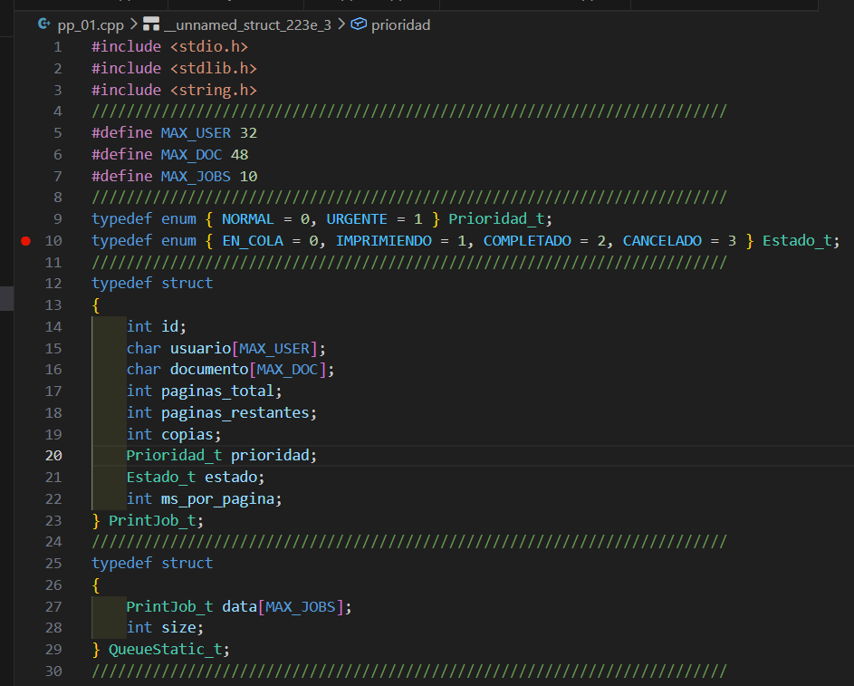

---

## Función para limpiar salto de línea

Esta función elimina el salto de línea que se genera cuando se utiliza `fgets`, permitiendo limpiar correctamente las cadenas de texto ingresadas por el usuario.

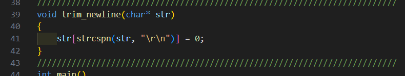

---

## Estructura del trabajo de impresión

El programa define una estructura llamada **PrintJob_t**, la cual almacena la información de cada trabajo de impresión.

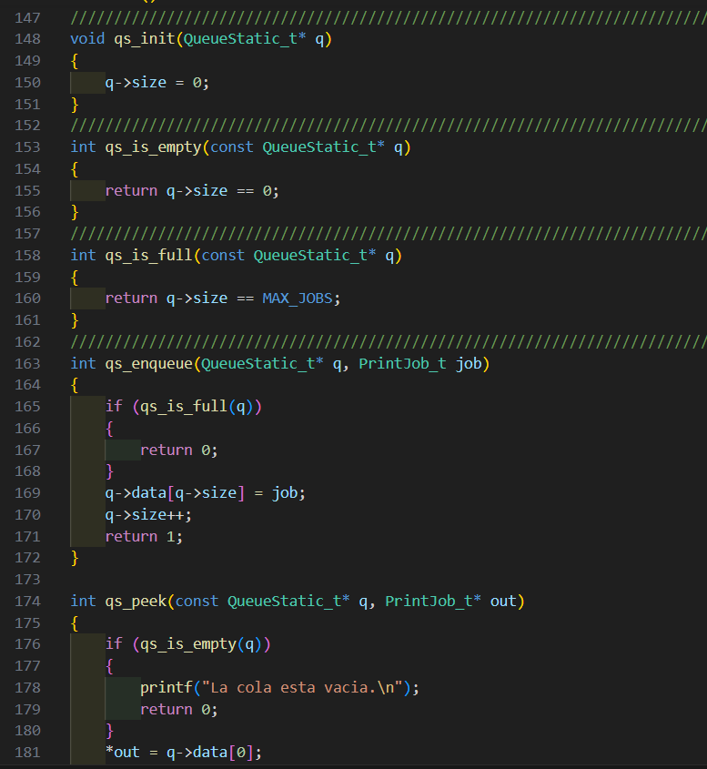

Esta estructura incluye:

- Identificador del trabajo
- Nombre del usuario
- Nombre del documento
- Número total de páginas
- Páginas restantes
- Número de copias
- Prioridad del trabajo
- Estado del trabajo
- Tiempo de impresión por página

---

## Estructura de la cola estática

La cola de impresión se administra mediante una estructura que contiene un arreglo de trabajos y un contador de elementos.

---

## Operaciones implementadas

El sistema permite realizar las siguientes operaciones:

- Inicializar la cola
- Verificar si la cola está vacía
- Verificar si la cola está llena
- Agregar un trabajo (`enqueue`)
- Visualizar el siguiente trabajo (`peek`)
- Procesar un trabajo (`dequeue`)
- Mostrar todos los trabajos

---

# Ejecución del código — Sesión 1

### Opción 1

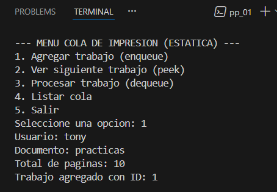

### Opción 2

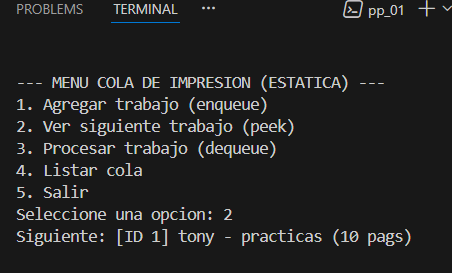

### Opción 3

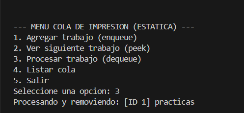
### Opción 4

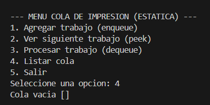

---

# Sesión 2 — Cola Dinámica

En la segunda implementación se utilizó **memoria dinámica** para almacenar los trabajos de impresión.

Esto permite que la cola pueda **crecer dinámicamente** según el número de trabajos enviados por los usuarios.

Para lograr esto se utilizan funciones como:

---

## Código de implementación dinámica

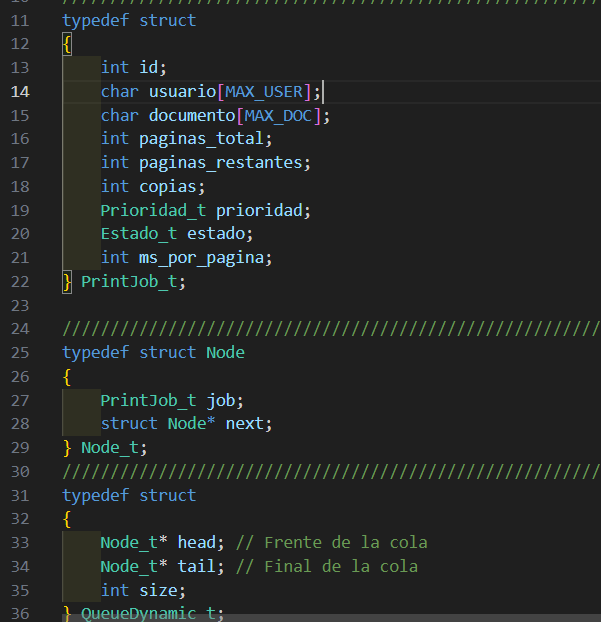

---

## Estructura de nodo

Cada trabajo se almacena dentro de un nodo de una lista enlazada.

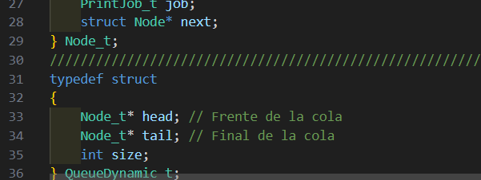

Cada nodo contiene:

- Un trabajo de impresión
- Un puntero al siguiente nodo

Esto permite crear una **lista enlazada**.

---

## Función enqueue

La función `enqueue` se encarga de agregar un nuevo trabajo al final de la cola.

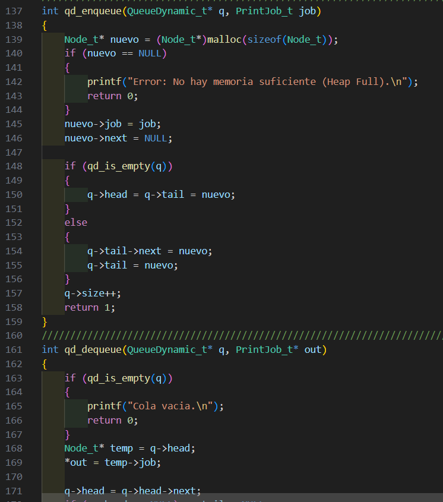

---

## Función dequeue

La función `dequeue` elimina el primer trabajo de la cola y libera la memoria utilizada.

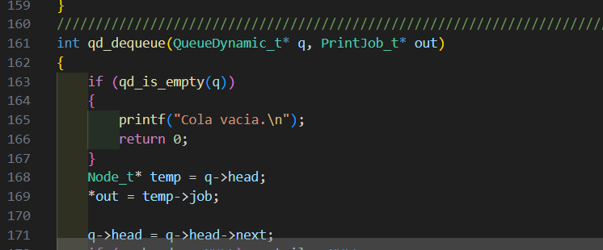

---

## Liberación de memoria

Antes de que el programa termine, se libera toda la memoria utilizada para evitar **fugas de memoria**.

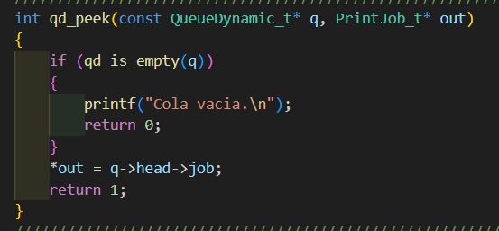
---

# Ejecución del código — Sesión 2

### Opción 1

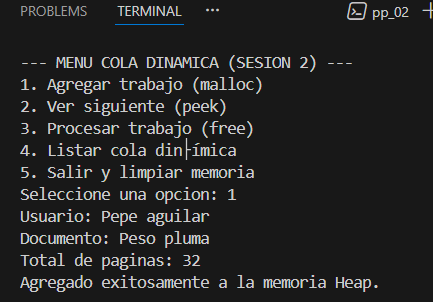

### Opción 2

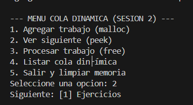

### Opción 3

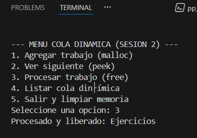

### Opción 4

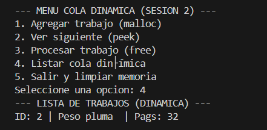

---

# Sesión 3 — Simulación de Cola de Impresión

En la tercera implementación se desarrolló una **simulación más completa del sistema de impresión**.

El sistema permite:

- Registrar trabajos de impresión
- Almacenarlos en una cola
- Simular el proceso de impresión página por página
- Mostrar estadísticas del sistema

---

## Código del sistema de simulación

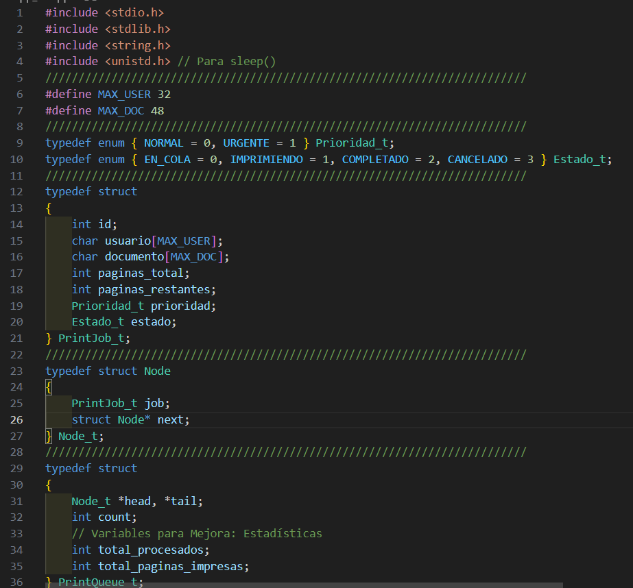

---

## Estructura de la cola de impresión

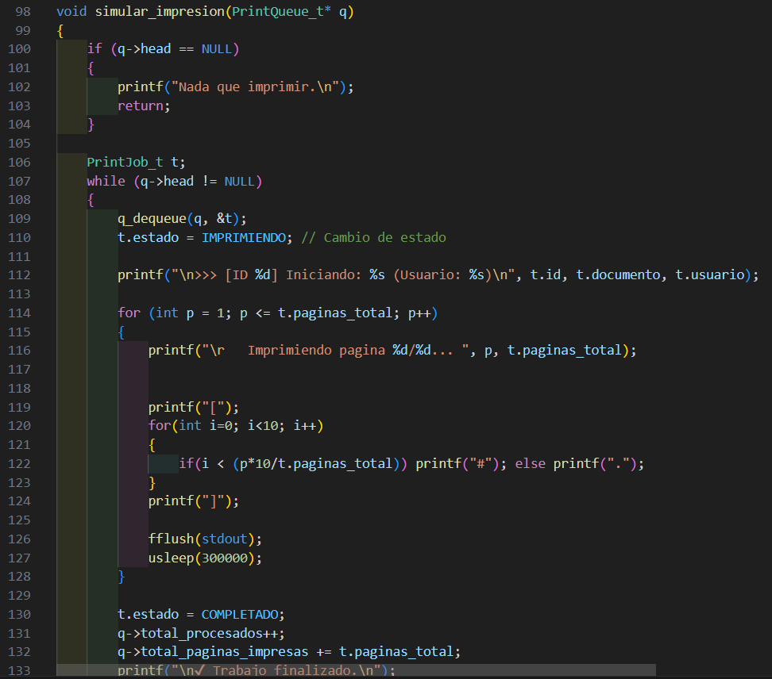

---

## Simulación del proceso de impresión

Durante la simulación el sistema muestra el avance de impresión página por página.

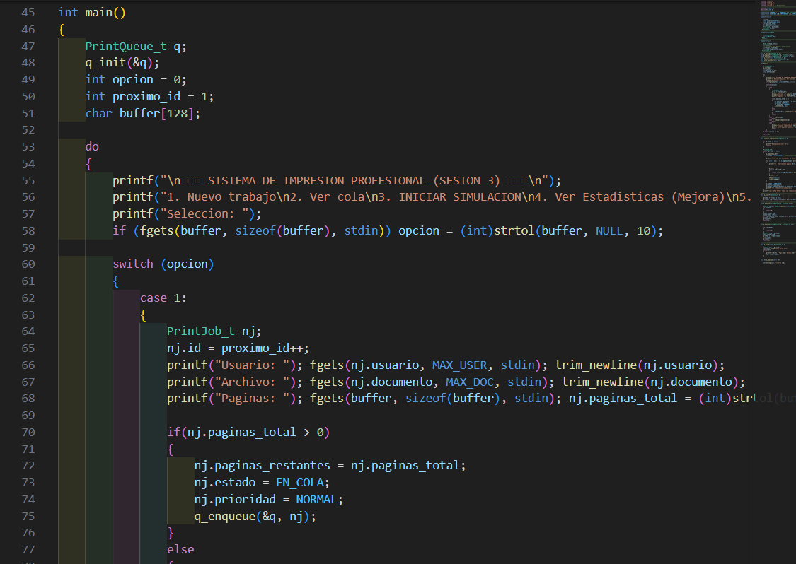

---

# Ejecución del código — Sesión 3

### Opción 1

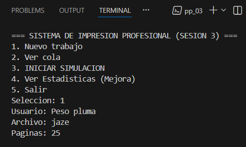

### Opción 2

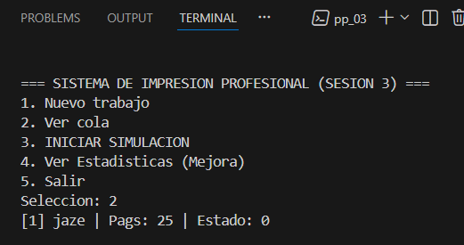

### Opción 3

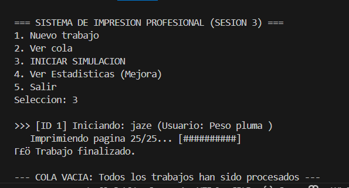

### Opción 4

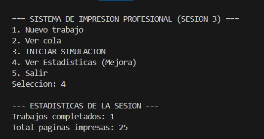
---

# Conclusión

A través del desarrollo de estos programas fue posible comprender diversos conceptos importantes de programación en lenguaje **C** y de **estructuras de datos**.

En el primer programa se implementó una **cola estática**, lo que permitió entender cómo almacenar datos utilizando arreglos con tamaño fijo.
 
En el segundo programa se implementó una **cola dinámica** utilizando listas enlazadas y memoria dinámica mediante `malloc` y `free`.

Finalmente, en el tercer programa se desarrolló una **simulación completa del proceso de impresión**, lo que permitió observar cómo los sistemas reales administran los trabajos enviados a una impresora.

En conjunto, esta práctica permitió reforzar conocimientos sobre:

- Estructuras
- Enumeraciones
- Punteros
- Manejo de memoria dinámica
- Listas enlazadas
- Estructuras de datos tipo cola

Además, permitió comprender cómo estos conceptos pueden aplicarse para resolver problemas reales dentro de sistemas informáticos. 